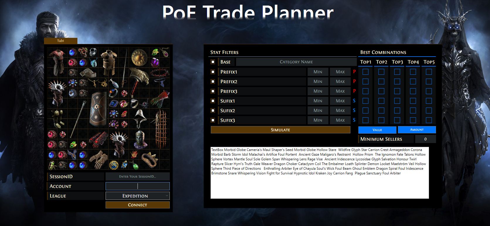

# PoE_Planner
PoE Planner is an program allowing you to simulate the most valuable combination of affixes based on the "Poe Trade" Website. 
First you need to import your stash tabs with items using your SessionID (Program is not verified on official website), league and account name.
Second based on your stash, choose item you are interested in and now you can simulate all combinations that was found in the data river (not tested yet, currently there is 5 years of data in the river, it can cause some small problems). There is an option to disable some affixes in case of exertion of huge pressure on the bandwidth.
If everything will work correctly, then i'll add some additional filters allowing to narrow search.

## Scripts location
All scripts are located in "PoE_Planner" folder

## Instalation
Program is not compiled yet
